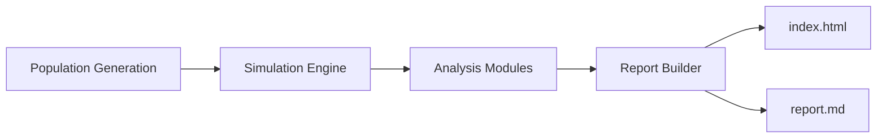

# PRP: GEL Scenario — Cohesive Reporting & Role-Minimums Configuration

## Executive Summary
This PRP proposes a focused improvement to the **Employee Simulation Orchestrator** when running the `GEL` scenario. It eliminates the proliferation of scattered artifacts (thousands of JSON/XLSX files, empty subfolders, timestamp-only paths) and replaces them with a **single HTML report** (all charts, metrics, and tables in one place) and a **single Markdown narrative** (with Mermaid diagrams) suitable for sharing as a management report. It also adds a **role→minimum-salary configuration** for GEL so we can model salary floors by job title and use multiple configs per organization. Finally, it encodes **manager-level intervention rules** (≤ 6 directs; 0.5% budget to address inequality) directly in the analysis and reporting layers.

## Problem Statement
When running `employee_simulation_orchestrator.py --scenario GEL`, the system produces:
- Excessive JSON/XLSX outputs
- Empty and timestamp-suffixed subfolders that obscure where data lives
- Hidden or hard-to-find artifacts
- No single, navigable artifact that explains _what was analyzed_, _key results_, and _recommended actions_

These issues make it difficult for managers and stakeholders to understand the analysis, the state of the population, how it is stratified, and how budget-constrained interventions should be applied.

## Goals
1. **One-pass reporting:** Generate **one `index.html`** and **one `report.md`** per run containing all key visuals, tables, and narrative.
2. **Narrative-first output:** The Markdown report should tell a coherent story of population structure, inequality, high-performer rewards, and recommended actions—**including Mermaid diagrams** for flows and structures.
3. **Deterministic output layout:** A clean directory structure with a human-readable run label and a small set of obvious artifacts (HTML, MD, `manifest.json`, and `assets/`).
4. **Policy-aware insights:** Model and report **manager intervention constraints**: each manager has up to **6 directs** and may allocate **0.5%** (of payroll for their reports) to remediate inequality.
5. **Role minimums config:** Introduce an editable **GEL role→minimum-salary config** (YAML/JSON), supporting multiple role bands when provided (e.g., “x2 roles” or two minima for the same title), and make this config selectable at runtime.
6. **Multi-config support:** Allow switching between organization presets (e.g., `--org GEL --roles-config path/to/roles.yaml`).
7. **explain remediation costs:** is this per year, per employee, in total? 

## Non-Goals
- Changing the core progression math or uplift matrices beyond what is necessary to respect role minimums and manager-budget constraints.
- Building a new web app UI. (We will output a single self-contained HTML report.)

## Deliverables
1. **HTML Report** (`index.html`): All charts, tables, and annotated findings embedded or referenced via `assets/`.
2. **Markdown Report** (`report.md`): The same key results as HTML, plus **Mermaid** diagrams for:
   - Data flow (simulation → analysis → reporting)
   - Budget allocation decision flow (per manager, ≤ 6 directs, 0.5% cap)
   - Population stratification overview
3. **Run Manifest** (`manifest.json`): Scenario metadata (org, roles-config hash, timestamp, seeds, inputs, KPIs).
4. **Clean Output Layout** (example):
   ```text
   results/GEL/run_2025-08-14_09-00Z/
   ├─ index.html
   ├─ report.md
   ├─ manifest.json
   └─ assets/
      ├─ charts/*.png
      ├─ tables/*.csv
      └─ figures/*.svg
   ```
   Optional convenience link: `results/GEL/latest/ → run_...` (symlink or copy on platforms that lack symlinks).
5. **Role Minimums Config Loader** with validation, schema, and examples.
6. **CLI Additions** and documented commands.
7. **Tests** for report generation, layout, and config ingestion.

## User Experience (Storyline of `report.md`)
1. **Overview & Inputs**
   - Scenario (`GEL`), date, seed, config hashes, population size, coverage.
2. **Population Stratification**
   - By level/role/title, gender and other relevant attributes, medians/percentiles, headcount by manager.
3. **Inequality & Risk**
   - Below-median cohorts, gap estimates by segment, role-minimum compliance.
4. **High-Performer Recognition (within constraints)**
   - Who qualifies, estimated uplift cost, trade-offs within **0.5%** budget per manager (max **6** directs).
5. **Recommendations**
   - Targeted adjustments: names (or IDs), roles, proposed uplift, expected effect on inequality metrics.
6. **Appendix**
   - Assumptions, data dictionary, role minima reference, reproducibility notes.

## Reporting Requirements
- **Single HTML**: Interactive charts if possible (embedded), otherwise static PNG/SVG with anchors; sectioned ToC.
- **Single Markdown**: Same sections, **Mermaid** diagrams (example snippets provided below).
- **Stable IDs** in headings for easy cross-referencing.
- **All figures/tables referenced from body text** with interpretive captions.

### Example Mermaid Diagrams for `report.md`
**Data Flow**


**Manager Budget Allocation**
```mermaid
flowchart TD
  M[Manager (≤ 6 directs)] -->|0.5% budget| P{Prioritize?}
  P -->|Below-median & High Performer| A[Recommend Uplift]
  P -->|Not eligible| N[No Change]
  A --> R[Recalculate Inequality KPIs]
  R -->|Improves w/in cap| OK[Accept]
  R -->|Exceeds cap| T[Trim / Stage]
```

## Role→Minimum Salary Configuration
- **Format**: YAML (JSON supported equivalently).
- **Semantics**:
  - `min_salaries`: one or multiple entry-level minima (to handle “x2 roles” / dual minima cases).
  - `headcount_hint`: optional expected openings/headcount from the source list (used only for weighting/sanity checks).
  - `notes`: any clarifications (e.g., fixed-term, team, or track).

**Example `config/orgs/GEL/roles.yaml`**
```yaml
org: GEL
currency: GBP
version: 1
intervention_policy:
  max_direct_reports: 6
  inequality_budget_percent: 0.5   # per-manager budget cap
roles:
  - title: "Airlock Coordinator"
    min_salaries: [37000]
  - title: "Data Engineer"
    min_salaries: [73000]
    headcount_hint: 4
  - title: "Director of Equity Assurance"
    min_salaries: [101500]
    notes: "18-month FTC"
  - title: "Genome Analyst"
    min_salaries: [47500, 60000]
    headcount_hint: 2
  - title: "Platform Engineer"
    min_salaries: [71500]
  - title: "Platform Engineer - EDS"
    min_salaries: [71500]
  - title: "QA Engineer - Python"
    min_salaries: [53500]
  - title: "R&D Laboratory Scientist"
    min_salaries: [33500]
    notes: "12-month FTC"
  - title: "Senior Product Designer"
    min_salaries: [63300, 71300]
  - title: "Solutions Architect"
    min_salaries: [93500]
  - title: "Applied Machine Learning Researcher"
    min_salaries: [70500]
  - title: "Audience Engagement Lead"
    min_salaries: [65500]
    headcount_hint: 2
  - title: "Bioinformatics Engineer"
    min_salaries: [56000]
  - title: "Chief Information Security Officer"
    min_salaries: [127000]
  - title: "Committee Manager - Participant Panel"
    min_salaries: [44500]
  - title: "Cyber Security Engineer"
    min_salaries: [71500]
  - title: "Director of Portfolio Management"
    min_salaries: [92000]
  - title: "Genomic Data Scientist"
    min_salaries: [55000]
    headcount_hint: 2
  - title: "Infrastructure Architect"
    min_salaries: [86000]
  - title: "Platform Engineer (12 Month FTC)"
    min_salaries: [71500]
  - title: "Platform Engineer (CCoE)"
    min_salaries: [71500]
  - title: "Platform Engineer (HPC)"
    min_salaries: [71500]
  - title: "Principal Engineer (SRE)"
    min_salaries: [103500]
  - title: "QA Engineer (Genie)"
    min_salaries: [53500]
  - title: "QA Engineer (KDMS)"
    min_salaries: [53000]
  - title: "Scientific Curator"
    min_salaries: [47500]
  - title: "Senior Platform Engineer (Developer Platform)"
    min_salaries: [76500]
    headcount_hint: 2
  - title: "Senior QA Engineer"
    min_salaries: [55500]
  - title: "Service Owner DDSR"
    min_salaries: [113500]
    notes: "12-month FTC"
  - title: "Software Engineer"
    min_salaries: [71500]
  - title: "Strategic Communications Lead"
    min_salaries: [64000, 65500]
    notes: "18-month FTC"
```

> **Importer rules**: If multiple minima are provided for a single title, treat them as adjacent entry bands or sub-levels. During population seeding, use the lowest band as the floor for that role unless a higher band is explicitly selected by grade/track.

## Technical Approach

### A. Output Layout & Artifact Reduction
- Replace bulk per-entity JSON/XLSX dumps with:
  - `manifest.json` (summary stats, pointers to derived tables),
  - `assets/tables/*.csv` for key tables only,
  - `assets/charts/*.png` or inline SVG for figures used in the reports.
- Provide a `--keep-artifacts` flag to retain detailed dumps when needed.

### B. Report Builders
- **Markdown Builder** (`report_builder_md.py`): Assembles narrative, embeds Mermaid code blocks, writes `report.md`.
- **HTML Builder** (`report_builder_html.py`): Converts the Markdown or directly renders Jinja2 templates into `index.html`; embeds charts or links to `assets/`.
- Both builders consume a common `analysis_payload.json` produced by the orchestrator.

### C. Role-Minimums Enforcement
- New `roles_config.py`:
  - Schema validation (pydantic or jsonschema).
  - Accessors: `get_minimum_for_role(title, grade=None)`.
  - Wiring into population generation and compliance checks in analysis.

### D. Policy-Constrained Recommendations
- Extend the intervention logic to respect:
  - `max_direct_reports = 6` (per manager, only consider up to 6 reports for their pool).
  - `inequality_budget_percent = 0.5` (budget for adjustments is 0.5% of the manager’s total direct-report payroll).
- Optimizer proposes an **ordered list of adjustments** (start with below-median **and** high-performing individuals) and trims to cap.

### E. CLI Additions
```bash
# Produce cohesive reports for GEL with a specific roles config
python employee_simulation_orchestrator.py   --scenario GEL   --org GEL   --roles-config config/orgs/GEL/roles.yaml   --report   --out results/GEL

# Keep verbose artifacts (opt-in)
python employee_simulation_orchestrator.py --scenario GEL --report --keep-artifacts
```

### F. Testing
- Snapshot tests for `index.html`/`report.md` headings & required sections.
- Schema tests for `roles.yaml` (unknown fields, malformed salaries, currency mismatch).
- Golden tests for policy constraints (≤ 6 directs, 0.5% budget respected).

## Acceptance Criteria
- Running `--scenario GEL --report` creates **exactly one** `index.html` and **one** `report.md` in a deterministic run folder, plus `manifest.json` and an `assets/` dir.
- `report.md` includes at least **three** Mermaid diagrams (flow, budget allocation, stratification).
- Role minima are enforced during seeding and analysis; the report flags any simulated salaries below role floors.
- Manager interventions are recommended **within** the 0.5% cap and **prioritize** below-median high performers; recommendations list the trade-offs.
- All paths and artifacts are discoverable from `manifest.json` and section links; no empty subfolders are created by default.

## Version Control / Branching
Create a feature branch:
```
feature/gel-reporting-and-roles-config-task1
```
Submit iterative PRs:
1. Report builders + layout
2. Role config ingestion + validation
3. Policy-constrained recommendations
4. Tests + docs

## Risks & Mitigations
- **Ambiguous titles or multiple minima** → Parse into `min_salaries: []` + `notes`, require reviewer acknowledgment; include YAML schema & CI validation.
- **Large embedded HTML** → Option to link heavier figures from `assets/` to keep `index.html` small.
- **Backward compatibility** → `--report` is additive; legacy verbose outputs available via `--keep-artifacts`.

## Documentation
- `docs/GEL_reporting.md`: user guide with screenshots
- `docs/roles_config_schema.md`: schema, examples, and linting steps

---

**Appendix A — Example KPIs for the Manifest**
```json
{
  "scenario": "GEL",
  "org": "GEL",
  "roles_config_sha256": "…",
  "population": 10000,
  "median_salary": 71500,
  "below_median_pct": 42.3,
  "gender_gap_pct": 6.8,
  "intervention_budget_pct": 0.5,
  "recommended_uplifts_cost_pct": 0.49,
  "timestamp_utc": "2025-08-14T09:00:00Z"
}
```
