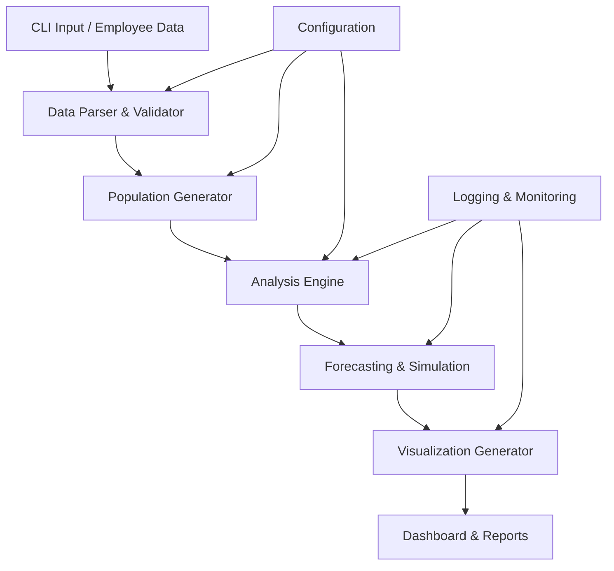

# Employee Simulation System

A comprehensive Python-based system for simulating employee populations, analyzing salary equity, and generating actionable insights for HR decision-making. This system provides sophisticated modeling of employee career progression, salary forecasting, and pay gap analysis with executive-ready visualizations and recommendations.

## 🎯 Overview

The Employee Simulation System is designed for organizations to:
- **Simulate realistic employee populations** with diverse levels, salaries, and performance ratings
- **Analyze salary equity and pay gaps** across gender, level, and department dimensions  
- **Project individual career progression** with scenario-based salary forecasting
- **Generate intervention strategies** for closing pay gaps and improving retention
- **Create executive dashboards** with actionable insights and recommendations

## ✨ Key Features

### 🧑‍💼 Individual Employee Analysis
- Parse employee data from command-line or file inputs
- 5-year salary progression forecasting with confidence intervals
- Performance-based career trajectory modeling
- Interactive salary projection visualizations
- Median convergence analysis for below-median employees

### 👥 Population-Level Analysis
- Generate realistic employee populations (100-10,000+ employees)
- Advanced pay gap analysis with statistical significance testing
- Intervention cost modeling and ROI analysis
- Executive summary dashboards with key metrics

### 📊 Comprehensive Reporting
- Interactive HTML dashboards for executives
- Detailed JSON exports for technical analysis
- Publication-ready visualizations
- Automated story tracking for individual employee journeys

### 🔧 Advanced Modeling
- Monte Carlo simulations for salary projections
- Performance review cycle modeling
- Market inflation and competitive adjustment factors
- Configurable confidence intervals and risk assessments

## 🚀 Quick Start

### Prerequisites
- Python 3.8+
- pip package manager
- 2GB+ available disk space (for large population simulations)

### Installation

```bash
# Clone the repository
git clone https://github.com/bruvio/employee-simulation-system.git
cd employee-simulation-system

# Install dependencies
pip install -r requirements.txt

# Verify installation
python employee_simulation_orchestrator.py --help
```

### Basic Usage

#### Analyze Individual Employee
```bash
# Basic individual analysis
python employee_simulation_orchestrator.py \
  --scenario individual \
  --employee-data "level:5,salary:80692.5,performance:Exceeding"

# With custom analysis period
python employee_simulation_orchestrator.py \
  --scenario individual \
  --employee-data "level:3,salary:65000,performance:Achieving" \
  --analysis-years 7
```

#### Generate Population Analysis
```bash
# Standard population analysis (100 employees)
python employee_simulation_orchestrator.py --scenario basic

# Large-scale analysis with custom parameters
python employee_simulation_orchestrator.py \
  --scenario basic \
  --population-size 1000 \
  --max-cycles 20 \
  --random-seed 12345
```

#### Using the Makefile
```bash
# Run all quality checks
make test
make flake  
make black

# Run the application
make run

# Analyze individual employee
make analyze-individual EMPLOYEE_DATA="level:4,salary:70000,performance:High Performing"
```

## 📋 System Architecture

### Core Components

```
employee-simulation-system/
├── 🎮 Core Orchestration
│   ├── employee_simulation_orchestrator.py    # Main entry point and CLI
│   └── config_examples.py                     # Configuration templates
│
├── 👥 Population Simulation  
│   ├── employee_population_simulator.py       # Generate realistic populations
│   ├── individual_progression_simulator.py    # Model career trajectories
│   └── salary_forecasting_engine.py          # Advanced salary projections
│
├── 📊 Analysis & Intelligence
│   ├── median_convergence_analyzer.py         # Pay gap convergence analysis
│   ├── intervention_strategy_simulator.py     # Cost-benefit modeling
│   └── analyze_individual_progression.py      # Individual career analysis
│
├── 📈 Visualization & Reporting
│   ├── visualization_generator.py             # Statistical charts
│   ├── interactive_dashboard_generator.py     # Web-based dashboards
│   ├── management_dashboard_generator.py      # Executive summaries
│   └── analysis_narrator.py                  # Automated insights
│
├── 🔧 Utilities & Infrastructure
│   ├── individual_employee_parser.py          # Data parsing & validation
│   ├── smart_logging_manager.py              # Intelligent logging
│   ├── file_optimization_manager.py          # Performance optimization
│   └── performance_optimization_manager.py    # System tuning
│
└── 📦 Testing & Quality
    ├── tests/                                 # Comprehensive test suite
    ├── Makefile                              # Build automation
    └── requirements.txt                       # Dependencies
```

### Data Flow



## 🎛️ Configuration

The system uses YAML-based configuration with environment-specific overrides:

```python
# Basic configuration
config = {
    "population_size": 100,
    "max_cycles": 15,
    "analysis_years": 5,
    "generate_visualizations": True,
    "export_formats": ["json", "csv"],
    "confidence_interval": 0.95,
    "market_inflation_rate": 0.025
}
```

### Scenario Types
- `individual`: Single employee career analysis
- `basic`: Standard population simulation (100-500 employees)
- `large_scale`: Enterprise simulation (1000+ employees)
- `equity_focused`: Pay gap analysis with intervention modeling

## 📖 Usage Examples

### Example 1: Individual Career Analysis
```bash
python employee_simulation_orchestrator.py \
  --scenario individual \
  --employee-data "level:3,salary:65000,performance:High Performing,gender:Female,tenure:2"
```

**Output:**
- 5-year salary progression (Conservative/Realistic/Optimistic scenarios)
- Annual growth rate calculations
- Median convergence analysis
- Performance-based recommendations
- Interactive visualization chart

### Example 2: Department Pay Gap Analysis
```bash
python employee_simulation_orchestrator.py \
  --scenario equity_focused \
  --population-size 500 \
  --log-level debug
```

**Output:**
- Gender pay gap statistics
- Level-based equity analysis  
- Intervention cost modeling
- Executive dashboard with recommendations
- Risk assessment and compliance metrics

### Example 3: Large-Scale Simulation
```bash
python employee_simulation_orchestrator.py \
  --scenario large_scale \
  --population-size 2000 \
  --max-cycles 25 \
  --analysis-years 7
```

**Output:**
- Comprehensive population analysis
- Advanced statistical modeling
- Performance optimization recommendations
- Detailed technical reports
- Publication-ready visualizations

## 📊 Output Files & Artifacts

### Generated Artifacts
```
artifacts/
├── individual_analysis/           # Individual employee reports
│   ├── individual_analysis_*.json
│   └── visualizations/
│       └── salary_projection_*.html
├── advanced_analysis/             # Population-level analysis
│   ├── management_dashboard_*.html
│   ├── technical_analysis_*.json
│   └── charts/
└── exports/                       # Data exports
    ├── population_data_*.csv
    └── analysis_results_*.json
```

### Key Output Types

1. **JSON Reports**: Detailed technical analysis with all calculations
2. **HTML Dashboards**: Executive-ready visualizations with insights
3. **CSV Exports**: Raw data for external analysis
4. **Interactive Charts**: Plotly-based visualizations for presentations

## 🧪 Testing & Quality

```bash
# Run all tests
make test

# Code quality checks  
make flake
make black-check

# Generate coverage report
pytest --cov=. --cov-report=html
```

### Test Coverage
- Unit tests for all core components (48 test cases)
- Integration tests for end-to-end workflows
- Performance benchmarks for large populations
- Data validation and edge case handling

## 🔍 Troubleshooting

### Common Issues

**ImportError**: Missing dependencies
```bash
pip install -r requirements.txt
```

**Memory Issues**: Large populations (>5000 employees)
```bash
# Reduce population size or enable optimization
python employee_simulation_orchestrator.py --scenario basic --population-size 1000
```

**Visualization Errors**: Missing plotting libraries
```bash
pip install plotly matplotlib seaborn
```

### Debug Mode
```bash
python employee_simulation_orchestrator.py --scenario individual --log-level debug --employee-data "level:5,salary:80000,performance:Exceeding"
```

## 🤝 Contributing

1. Fork the repository
2. Create a feature branch: `git checkout -b feature/new-analysis`
3. Make changes with tests: `make test`
4. Ensure code quality: `make flake && make black`
5. Submit a pull request

### Development Setup
```bash
# Install development dependencies
pip install -r requirements-dev.txt

# Install pre-commit hooks
pre-commit install

# Run full test suite
make test
```

## 📄 License

This project is licensed under the MIT License - see the [LICENSE](LICENSE) file for details.

## 🙋‍♀️ Support & Contact

- **Issues**: [GitHub Issues](https://github.com/bruvio/employee-simulation-system/issues)
- **Documentation**: [Wiki](https://github.com/bruvio/employee-simulation-system/wiki)  
- **Author**: [bruvio](https://github.com/bruvio)

---

**Built with ❤️ for HR Analytics and People Operations**

*This system is designed to promote pay equity, career development, and data-driven HR decision making.*