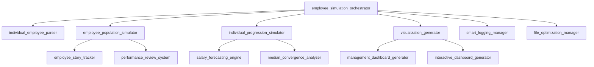

# Developer Guide - Employee Simulation System

This guide provides technical details for developers working on or extending the Employee Simulation System. It covers architecture, code organization, testing strategies, and contribution guidelines.

## Table of Contents

- [System Architecture](#system-architecture)
- [Codebase Structure](#codebase-structure)
- [Core Components](#core-components)
- [Data Models](#data-models)
- [Development Setup](#development-setup)
- [Testing Strategy](#testing-strategy)
- [Performance Considerations](#performance-considerations)
- [Extension Guidelines](#extension-guidelines)

## System Architecture

### High-Level Design

The Employee Simulation System follows a modular architecture with clear separation of concerns:

```
┌─────────────────────────────────────────────────────────────────┐
│                        User Interface Layer                      │
├─────────────────────────────────────────────────────────────────┤
│  employee_simulation_orchestrator.py (CLI, Main Orchestration)   │
├─────────────────────────────────────────────────────────────────┤
│                      Business Logic Layer                        │
├─────────────────┬─────────────────┬─────────────────┬────────────┤
│   Population    │    Individual   │   Analysis &    │Visualization│
│   Simulation    │   Progression   │  Intelligence   │ & Reporting │
├─────────────────┼─────────────────┼─────────────────┼────────────┤
│                      Infrastructure Layer                        │
├─────────────────┬─────────────────┬─────────────────┬────────────┤
│     Logging     │   File I/O      │   Performance   │  Testing   │
│   Management    │   Management    │   Optimization  │   Suite    │
└─────────────────┴─────────────────┴─────────────────┴────────────┘
```

### Design Principles

1. **Modular Design**: Each component has a single responsibility
2. **Dependency Injection**: Configuration passed down through layers
3. **Separation of Concerns**: Data, business logic, and presentation are separate
4. **Extensibility**: New analysis types and visualizations can be added easily
5. **Testability**: Components can be unit tested in isolation

## Codebase Structure

### Directory Layout

```
employee-simulation-system/
├── 📁 Core Application Files
│   ├── employee_simulation_orchestrator.py    # Main CLI and orchestration
│   ├── config_examples.py                     # Configuration templates
│   └── individual_employee_parser.py          # Data parsing and validation
│
├── 📁 Population & Simulation
│   ├── employee_population_simulator.py       # Population generation
│   ├── individual_progression_simulator.py    # Career trajectory modeling  
│   ├── salary_forecasting_engine.py          # Salary projection algorithms
│   └── employee_story_tracker.py             # Employee journey tracking
│
├── 📁 Analysis & Intelligence
│   ├── median_convergence_analyzer.py         # Pay gap convergence analysis
│   ├── intervention_strategy_simulator.py     # Cost-benefit intervention modeling
│   ├── analyze_individual_progression.py      # Individual career analysis
│   └── performance_review_system.py          # Performance evaluation logic
│
├── 📁 Visualization & Reporting
│   ├── visualization_generator.py             # Chart and graph generation
│   ├── interactive_dashboard_generator.py     # Interactive web dashboards
│   ├── management_dashboard_generator.py      # Executive summary dashboards
│   ├── analysis_narrator.py                  # Automated insight generation
│   └── advanced_story_export_system.py       # Story export and formatting
│
├── 📁 Infrastructure & Utilities
│   ├── smart_logging_manager.py              # Intelligent logging system
│   ├── file_optimization_manager.py          # File I/O optimization
│   ├── performance_optimization_manager.py    # System performance tuning
│   ├── data_export_system.py                 # Data export functionality
│   └── logger.py                             # Basic logging utilities
│
├── 📁 Testing & Quality Assurance
│   ├── tests/                                 # Comprehensive test suite
│   │   ├── test_basic.py                      # Basic functionality tests
│   │   ├── test_individual_employee_parser.py # Parser validation tests
│   │   ├── test_salary_forecasting.py         # Forecasting algorithm tests
│   │   └── test_*.py                          # Component-specific tests
│   ├── Makefile                              # Build and automation scripts
│   ├── requirements.txt                       # Production dependencies
│   └── requirements-test.txt                  # Testing dependencies
│
└── 📁 Documentation & Configuration
    ├── docs/                                 # Documentation files
    ├── artifacts/                            # Generated output files
    └── README.md                             # Main project documentation
```

### Module Dependencies



## Core Components

### 1. Main Orchestrator (`employee_simulation_orchestrator.py`)

**Purpose**: Central coordination and CLI interface

**Key Responsibilities:**
- Command-line argument parsing
- Scenario selection and configuration
- Component initialization and coordination
- Error handling and user feedback

**Key Functions:**
```python
def main() -> None
def run_individual_employee_analysis(employee_data, config: Dict[str, Any]) -> None
def run_simulation_with_config(config: Dict[str, Any]) -> Dict[str, Any]
def export_individual_analysis_results(employee_data, analysis_results: Dict[str, Any]) -> None
```

**Configuration Flow:**
```python
# Default configuration
config = {
    "population_size": 100,
    "max_cycles": 15,
    "analysis_years": 5,
    "generate_visualizations": True,
    "export_formats": ["json", "csv"],
    "confidence_interval": 0.95,
    "market_inflation_rate": 0.025
}

# Command-line overrides applied
# Scenario-specific configurations loaded
# Passed to relevant components
```

### 2. Employee Data Parser (`individual_employee_parser.py`)

**Purpose**: Parse, validate, and normalize employee data

**Core Classes:**
```python
class EmployeeData(BaseModel):
    """Pydantic model for employee data validation"""
    employee_id: int = Field(default=1)
    name: str = Field(default="Individual Employee")  
    level: int = Field(..., ge=1, le=6)
    salary: float = Field(..., gt=0)
    performance_rating: str = Field(...)
    gender: str = Field(default="Female")
    tenure_years: int = Field(default=1, ge=0)
    department: str = Field(default="Engineering")

class IndividualEmployeeParser:
    """Parser for employee data from various formats"""
    @staticmethod
    def parse_from_string(data_string: str) -> Dict[str, Any]
    @staticmethod  
    def parse_from_dict(data_dict: Dict[str, Any]) -> Dict[str, Any]
    @staticmethod
    def validate_and_create(employee_data: Dict[str, Any]) -> EmployeeData
```

**Validation Rules:**
- Level: Must be 1-6
- Salary: Must be positive, within reasonable range for level
- Performance: Must be valid rating ("Not met", "Partially met", "Achieving", "High Performing", "Exceeding")
- Gender: Must be "Male" or "Female"

### 3. Salary Forecasting Engine (`salary_forecasting_engine.py`)

**Purpose**: Advanced salary projection algorithms

**Key Algorithms:**
```python
class SalaryForecastingEngine:
    def calculate_cagr(self, start_salary: float, end_salary: float, years: int) -> float:
        """Compound Annual Growth Rate calculation"""
        
    def project_compound_growth(self, initial_salary: float, annual_rate: float, years: int) -> float:
        """Project salary with compound growth"""
        
    def calculate_confidence_intervals(self, base_projection: float, confidence_level: float) -> Tuple[float, float]:
        """Calculate statistical confidence intervals"""
        
    def generate_performance_scenarios(self, employee_data: Dict, years: int) -> Dict[str, Dict]:
        """Generate multiple projection scenarios"""
```

**Projection Models:**
- **Conservative**: Lower growth rates, minimal performance improvements
- **Realistic**: Expected growth based on historical data and performance
- **Optimistic**: Higher growth rates assuming sustained high performance

### 4. Population Simulator (`employee_population_simulator.py`)

**Purpose**: Generate realistic employee populations

**Generation Strategy:**
```python
class EmployeePopulationGenerator:
    def generate_population(self, size: int, config: Dict) -> List[Dict]:
        """Generate diverse employee population"""
        
    def apply_level_distribution(self, employees: List[Dict], distribution: List[float]) -> None:
        """Apply custom level distributions"""
        
    def apply_salary_constraints(self, employees: List[Dict]) -> None:
        """Apply realistic salary constraints by level"""
        
    def apply_gender_pay_gap(self, employees: List[Dict], gap_percent: float) -> None:
        """Simulate gender pay gap effects"""
```

**Population Characteristics:**
- Level distribution follows configurable patterns
- Salary ranges by level with realistic constraints
- Performance rating distribution
- Gender representation
- Department assignment

### 5. Visualization System (`visualization_generator.py`, `management_dashboard_generator.py`)

**Purpose**: Generate charts, graphs, and executive dashboards

**Visualization Types:**
- Salary distribution histograms
- Performance correlation scatter plots
- Gender pay gap analysis charts
- Career progression timelines
- Executive KPI dashboards

**Technology Stack:**
- **Plotly**: Interactive web-based charts
- **Matplotlib**: Statistical plots
- **HTML/CSS**: Dashboard layouts
- **JavaScript**: Client-side interactivity

## Data Models

### Employee Record Structure

```python
employee_record = {
    "employee_id": int,           # Unique identifier
    "name": str,                  # Employee name
    "level": int,                 # Job level (1-6)
    "salary": float,              # Current salary
    "performance_rating": str,    # Performance rating
    "gender": str,                # Male/Female
    "tenure_years": int,         # Years of service
    "department": str,           # Department name
    "hire_date": str,            # Hire date (ISO format)
    "promotion_eligible": bool,   # Promotion eligibility
    "salary_band": str           # Salary band designation
}
```

### Analysis Results Structure

```python
analysis_results = {
    "scenarios": {
        "conservative": {
            "final_salary": float,
            "annual_growth_rate": float,
            "total_increase": float,
            "timeline_years": int
        },
        "realistic": { /* same structure */ },
        "optimistic": { /* same structure */ }
    },
    "convergence_analysis": {
        "below_median": bool,
        "gap_percent": float,
        "convergence_years": int,
        "intervention_required": bool
    },
    "recommendations": List[str],
    "risk_factors": List[str]
}
```

### Configuration Schema

```python
configuration = {
    # Population settings
    "population_size": int,
    "random_seed": int,
    "level_distribution": List[float],  # 6 values summing to 1.0
    
    # Analysis settings  
    "analysis_years": int,
    "max_cycles": int,
    "confidence_interval": float,      # 0.0 - 1.0
    "market_inflation_rate": float,    # 0.0 - 0.1
    
    # Output settings
    "generate_visualizations": bool,
    "export_formats": List[str],       # ["json", "csv", "html"]
    "auto_open_dashboard": bool,
    
    # Advanced settings
    "performance_variance": float,     # Performance rating variance
    "salary_negotiation_rate": float, # Percentage who negotiate
    "gender_pay_gap_percent": float   # Simulated pay gap
}
```

## Development Setup

### Environment Setup

```bash
# Clone repository
git clone https://github.com/bruvio/employee-simulation-system.git
cd employee-simulation-system

# Create virtual environment
python -m venv .venv
source .venv/bin/activate  # On Windows: .venv\Scripts\activate

# Install development dependencies
pip install -r requirements.txt
pip install -r requirements-test.txt

# Install pre-commit hooks (optional)
pre-commit install
```

### Development Dependencies

**Core Libraries:**
- `pandas>=1.5.0`: Data manipulation and analysis
- `numpy>=1.20.0`: Numerical computing
- `pydantic>=1.10.0`: Data validation and parsing
- `plotly>=5.0.0`: Interactive visualizations
- `matplotlib>=3.5.0`: Statistical plotting

**Development Tools:**
- `pytest>=7.0.0`: Testing framework
- `black>=22.0.0`: Code formatting
- `flake8>=5.0.0`: Code linting
- `pre-commit>=2.15.0`: Git hooks
- `mypy>=0.991`: Static type checking

### Code Style Guidelines

**Code Formatting:**
```bash
# Format code with Black (120 character line length)
make black

# Check formatting
make black-check
```

**Linting:**
```bash
# Run flake8 linting
make flake

# Configuration in setup.cfg:
[flake8]
max-line-length = 120
exclude = .venv,__pycache__,artifacts,images,htmlcov
```

**Type Hints:**
```python
# Use type hints for all public functions
def analyze_salary_progression(
    employee_data: Dict[str, Any], 
    years: int, 
    config: Optional[Dict[str, Any]] = None
) -> Dict[str, Any]:
    """Analyze salary progression with type hints."""
    pass
```

## Testing Strategy

### Test Organization

```
tests/
├── test_basic.py                      # Basic functionality
├── test_individual_employee_parser.py # Parser validation
├── test_salary_forecasting.py         # Forecasting algorithms
├── test_population_simulator.py       # Population generation
├── test_visualization.py              # Chart generation
└── test_integration.py                # End-to-end workflows
```

### Unit Testing

**Running Tests:**
```bash
# Run all tests
make test

# Run specific test file  
pytest tests/test_salary_forecasting.py -v

# Run with coverage
pytest --cov=. --cov-report=html
```

**Test Structure:**
```python
import pytest
from salary_forecasting_engine import SalaryForecastingEngine

class TestSalaryForecastingEngine:
    def setup_method(self):
        """Setup test fixtures"""
        self.engine = SalaryForecastingEngine()
        
    def test_cagr_calculation_basic(self):
        """Test basic CAGR calculation"""
        start_salary = 50000
        end_salary = 60000
        years = 5
        
        cagr = self.engine.calculate_cagr(start_salary, end_salary, years)
        expected = ((60000/50000) ** (1/5)) - 1
        
        assert abs(cagr - expected) < 0.001
        
    def test_invalid_inputs(self):
        """Test error handling for invalid inputs"""
        with pytest.raises(ValueError):
            self.engine.calculate_cagr(-1000, 50000, 5)
```

### Integration Testing

**End-to-End Tests:**
```python
def test_individual_employee_workflow():
    """Test complete individual employee analysis workflow"""
    # Parse employee data
    parser = IndividualEmployeeParser()
    employee_data = parser.parse_from_string("level:5,salary:80000,performance:Exceeding")
    
    # Run analysis
    orchestrator = EmployeeSimulationOrchestrator()
    results = orchestrator.run_individual_analysis(employee_data)
    
    # Verify outputs
    assert "scenarios" in results
    assert "realistic" in results["scenarios"]
    assert results["scenarios"]["realistic"]["final_salary"] > 80000
```

### Test Data Management

**Fixture Files:**
```python
# tests/fixtures/sample_employees.json
[
    {
        "level": 3,
        "salary": 65000,
        "performance_rating": "High Performing",
        "gender": "Female",
        "tenure_years": 2
    }
]

# Load in tests
@pytest.fixture
def sample_employees():
    with open('tests/fixtures/sample_employees.json') as f:
        return json.load(f)
```

## Performance Considerations

### Memory Management

**Large Population Handling:**
```python
def generate_large_population(size: int) -> Iterator[Dict[str, Any]]:
    """Generator for memory-efficient large population creation"""
    for i in range(size):
        yield generate_single_employee(i)

# Process in chunks
def process_population_chunks(population_size: int, chunk_size: int = 1000):
    for chunk_start in range(0, population_size, chunk_size):
        chunk_end = min(chunk_start + chunk_size, population_size)
        chunk = list(generate_large_population(chunk_end - chunk_start))
        process_chunk(chunk)
```

**Performance Monitoring:**
```python
import time
import psutil
import logging

def performance_monitor(func):
    """Decorator to monitor function performance"""
    def wrapper(*args, **kwargs):
        start_time = time.time()
        start_memory = psutil.Process().memory_info().rss
        
        result = func(*args, **kwargs)
        
        end_time = time.time()
        end_memory = psutil.Process().memory_info().rss
        
        logging.info(f"{func.__name__}: {end_time - start_time:.2f}s, "
                    f"Memory: {(end_memory - start_memory) / 1024 / 1024:.2f}MB")
        return result
    return wrapper
```

### Optimization Strategies

1. **Vectorized Operations**: Use pandas/numpy for bulk calculations
2. **Lazy Loading**: Load data only when needed
3. **Caching**: Cache expensive calculations
4. **Parallel Processing**: Use multiprocessing for independent tasks
5. **Memory Profiling**: Monitor memory usage patterns

## Extension Guidelines

### Adding New Analysis Types

1. **Create Analysis Module:**
```python
# new_analysis_type.py
class NewAnalysisEngine:
    def __init__(self, config: Dict[str, Any]):
        self.config = config
        
    def run_analysis(self, employee_data: Dict[str, Any]) -> Dict[str, Any]:
        """Implement your analysis logic"""
        return analysis_results
```

2. **Integrate with Orchestrator:**
```python
# In employee_simulation_orchestrator.py
def run_new_analysis_scenario(config: Dict[str, Any]) -> Dict[str, Any]:
    analyzer = NewAnalysisEngine(config)
    return analyzer.run_analysis(employee_data)

# Add to scenario mapping
SCENARIO_HANDLERS = {
    "individual": run_individual_employee_analysis,
    "basic": run_basic_scenario,
    "new_analysis": run_new_analysis_scenario,  # Add here
}
```

3. **Add Tests:**
```python
# tests/test_new_analysis.py
class TestNewAnalysisEngine:
    def test_new_analysis_basic(self):
        # Test your new analysis
        pass
```

### Adding New Visualization Types

1. **Extend Visualization Generator:**
```python
def generate_new_chart_type(self, data: Dict[str, Any]) -> str:
    """Generate new chart type"""
    fig = go.Figure()
    # Add your chart logic
    return self.save_chart(fig, "new_chart_type")
```

2. **Add to Dashboard:**
```python
# In management_dashboard_generator.py
def _create_new_dashboard_component(self) -> Dict[str, Any]:
    """Create new dashboard component"""
    return {
        "chart": self._generate_new_chart(),
        "summary": self._calculate_summary_stats()
    }
```

### Configuration Extension

**Adding New Configuration Options:**
```python
# In config schema
NEW_CONFIG_DEFAULTS = {
    "new_feature_enabled": True,
    "new_feature_parameter": 0.5,
    "new_feature_options": ["option1", "option2"]
}

# Validate new options
def validate_new_config(config: Dict[str, Any]) -> None:
    if config.get("new_feature_enabled"):
        assert "new_feature_parameter" in config
        assert 0 <= config["new_feature_parameter"] <= 1
```

### API Guidelines

**Function Signatures:**
```python
def public_api_function(
    required_param: RequiredType,
    optional_param: Optional[OptionalType] = None,
    config: Optional[Dict[str, Any]] = None
) -> ReturnType:
    """
    Brief description of function purpose.
    
    Args:
        required_param: Description of required parameter
        optional_param: Description of optional parameter  
        config: Configuration dictionary override
        
    Returns:
        Description of return value
        
    Raises:
        ValueError: When input validation fails
        RuntimeError: When processing fails
    """
```

**Error Handling:**
```python
def robust_function(data: Any) -> Any:
    try:
        # Main logic
        return process_data(data)
    except ValidationError as e:
        logger.error(f"Validation failed: {e}")
        raise ValueError(f"Invalid input data: {e}")
    except Exception as e:
        logger.error(f"Unexpected error in {__name__}: {e}")
        raise RuntimeError(f"Processing failed: {e}")
```

### Contributing Workflow

1. **Fork and Branch:**
```bash
git fork https://github.com/bruvio/employee-simulation-system.git
git checkout -b feature/new-analysis-type
```

2. **Development:**
```bash
# Make changes
# Add tests
make test
make flake
make black
```

3. **Documentation:**
```bash
# Update relevant documentation
# Add docstrings to new functions
# Update README.md if needed
```

4. **Pull Request:**
- Clear description of changes
- Link to related issues
- Include test results
- Follow PR template

---

## Additional Resources

- **API Reference**: [API.md](API.md) - Detailed API documentation
- **Architecture Decisions**: [docs/architecture/](../docs/architecture/) - Design decisions and rationale
- **Performance Benchmarks**: [docs/performance/](../docs/performance/) - Performance test results
- **Contributing Guide**: [CONTRIBUTING.md](../CONTRIBUTING.md) - Detailed contribution guidelines

*This developer guide provides the technical foundation for working with the Employee Simulation System. For user-facing documentation, see the [User Guide](USER_GUIDE.md).*