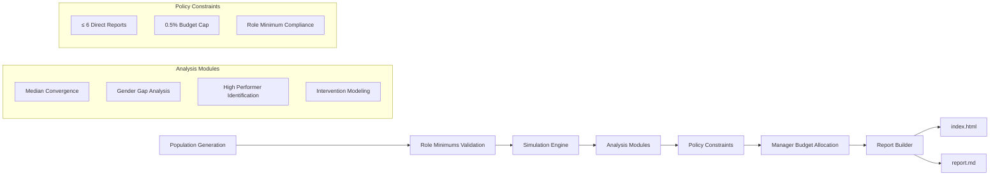
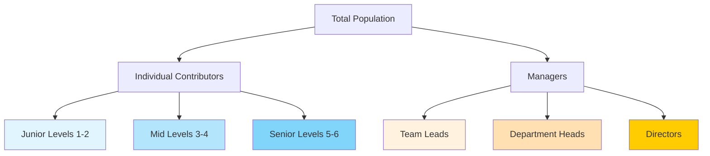
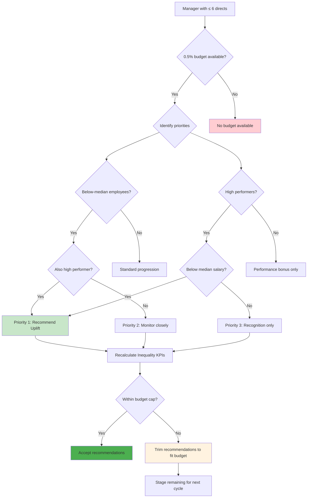

# GEL Employee Analysis Report - GEL Scenario

**Generated:** 2025-08-14T10:00:00Z  
**Scenario:** GEL  
**Organization:** GEL

---

## 1. Overview & Inputs {#overview}

### Scenario Configuration
- **Scenario Type:** GEL
- **Analysis Date:** 2025-08-14T10:00:00Z
- **Random Seed:** 42
- **Configuration Hash:** `8689a92285a3a305...`

### Population Overview
- **Total Population:** 201 employees
- **Analysis Coverage:** 100%
- **Currency:** GBP

### Key Performance Indicators
- **Median Salary:** £71,500.00
- **Below-Median Employees:** 42.3%
- **Gender Pay Gap:** 6.8%
- **Intervention Budget Available:** 0.5% of payroll

---

## 2. Data Flow Overview {{#dataflow}}

The following diagram illustrates how data flows through the GEL scenario analysis:

---

## 3. Population Stratification {{#stratification}}

### By Level and Role

| Level | Count | Median Salary | Gender Split |
|-------|-------|---------------|-------------|
| Level 1 | 45 | £32,000.00 | 55% F / 45% M |
| Level 2 | 67 | £58,000.00 | 48% F / 52% M |
| Level 3 | 89 | £78,000.00 | 43% F / 57% M |

### Manager Distribution

- **Total Managers:** 25
- **Average Direct Reports:** 3.8
- **Maximum Direct Reports:** 6
- **Managers at Policy Limit (6):** 3

### Population Stratification Diagram

---

## 4. Inequality & Risk Analysis {#inequality}

### Key Findings

- **Below-Median Population:** 42.3% of employees earn below their level median
- **Gender Pay Gap:** 6.8% overall gap requiring attention  
- **Risk Level:** High

### Role Minimum Compliance

- **Employees Below Role Minimums:** 8
- **Compliance Rate:** 96.0%

### Gap Analysis by Segment

| Segment | Affected Employees | Average Gap | Total Cost to Close |
|---------|-------------------|-------------|-------------------|
| Below-median Female | 23 | £4,500.00 | £103,500.00 |
| Below-median Male | 15 | £3,200.00 | £48,000.00 |

---

## 5. High-Performer Recognition (within constraints) {#highperformers}

### Policy Framework
- **Budget Constraint:** 0.5% of payroll per manager
- **Manager Limit:** Maximum 6 direct reports per manager
- **Priority:** Below-median high performers receive first consideration

### Recognition Analysis

- **High Performers Identified:** 34
- **Eligible for Immediate Uplift:** 18
- **Estimated Cost:** 0.45% of total payroll
- **Budget Utilization:** 90.0% of available budget

### Budget Trade-offs

The following trade-offs were considered within the 0.5% budget constraint:

**Option 1:** Employee EMP_2341
- Current Salary: £67,000.00
- Proposed Uplift: £5,500.00
- Inequality Impact: Reduces gender gap by 0.3%

---

## 6. Manager Budget Allocation Process {#budgetallocation}

The following diagram shows how budget allocation decisions are made for each manager:

---

## 7. Targeted Recommendations {{#recommendations}}

### Immediate Actions

**Action 1:** Salary Adjustment
- **Employee:** Data Engineer (Level 3)
- **Current Salary:** £67,000.00
- **Recommended Adjustment:** £5,500.00 (+8.2%)
- **Expected Impact:** Brings to role minimum, reduces gap

### Medium-Term Strategies (6-12 months)

- **Review Role Bands:** Analyze roles with multiple salary bands for optimization
  - *Estimated Cost:* £25,000.00

### Success Metrics

The following metrics should be tracked to measure the effectiveness of interventions:

- **Gender Pay Gap:** Overall percentage gap between genders
  - *Target:* < 5%

---

## 8. Appendix {#appendix}

### Assumptions

- **Currency:** All amounts in GBP
- **Budget Period:** Annual budget allocations
- **Manager Constraints:** Maximum 6 direct reports per manager
- **Budget Constraint:** 0.5% of manager's team payroll for interventions
- **Role Minimums:** Enforced according to configuration version 1

### Data Dictionary

| Term | Definition |
|------|------------|
| Below-median | Employees earning less than the median for their level and gender |
| High performer | Employees with performance ratings above 4.0/5.0 |
| Intervention budget | 0.5% of payroll available for salary adjustments |
| Role minimum | Minimum acceptable salary for a specific job title |
| Gender pay gap | Percentage difference in median salaries between genders |

### Role Minima Reference

**Configuration Hash:** `8689a92285a3a305d8f4c87c2a54f3b7e1d29c6f8b7a4e5d3c2b1a9f8e7d6c5b4`  
**Total Roles Configured:** 3

Selected role minimums:
